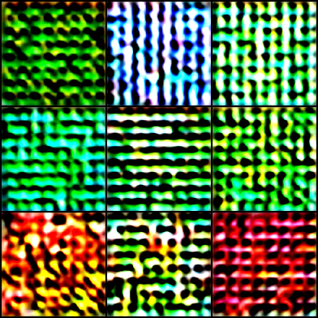
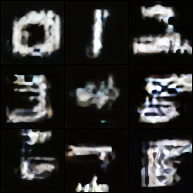
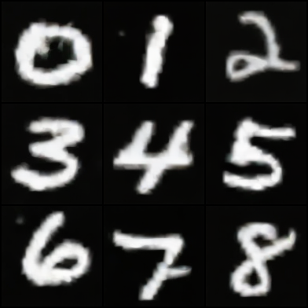
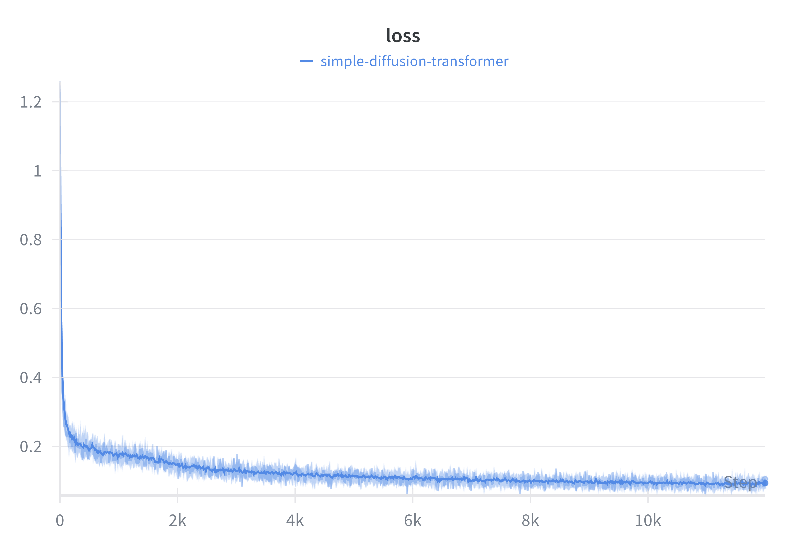
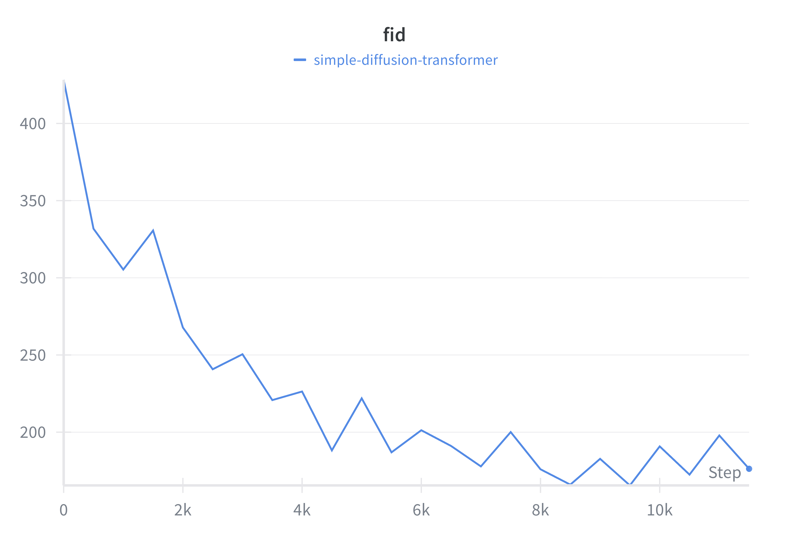

## Simple Diffusion Transformer

A simple implementation of a Latent Diffusion Transformer (DiT) model trained on MNIST.

<p align="center">
  
  
  
</p>

<p align="center">
  
  
</p>

## Overview

This project provides a minimal implementation of a diffusion transformer for educational purposes. It features:
- **Architecture**: Diffusion Transformer (DiT) operating in latent space.
- **Dataset**: MNIST (upscaled and converted to RGB).
- **VAE**: Uses a frozen pre-trained VAE (`stabilityai/sd-vae-ft-mse`) to compress images into latents.
- **Noise Schedule**: Simple linear interpolation schedule (x_t = (1-t)\ x_0 + t\epsilon)

## Prerequisites

- [uv](https://github.com/astral-sh/uv) (for dependency management)

## Quickstart (Local)

1. **Clone the repository**
   ```bash
   git clone https://github.com/andre/simple-diffusion-transformer.git
   cd simple-diffusion-transformer
   ```

2. **Install dependencies**
   ```bash
   uv sync
   ```

3. **Train the model**
   
   Simple run:
   ```bash
   uv run train.py
   ```

   Or with Accelerate (recommended for mixed precision/multi-GPU):
   ```bash
   uv run accelerate config  # Run once to configure
   uv run accelerate launch train.py
   ```

## Configuration

The training script `train.py` accepts several arguments:

| Argument | Default | Description |
|----------|---------|-------------|
| `--epochs` | 100 | Number of training epochs |
| `--batch_size` | 32 | Batch size per device |
| `--lr` | 1e-4 | Learning rate |
| `--hidden_size` | 512 | Transformer hidden size |
| `--num_layers` | 12 | Number of transformer layers |
| `--num_heads` | 8 | Number of attention heads |
| `--log` | False | Enable WandB logging |
| `--save_every` | 10 | Save checkpoint every N epochs |
| `--sample_every` | 500 | Generate samples every N steps |

Example:
```bash
uv run train.py --epochs 50 --batch_size 64 --log
```

## Docker Deployment

### 1. Build and Push Image
First, build the image and push it to a registry (like Docker Hub or GHCR).

```bash
# Configure accelerate (if not done)
uv run accelerate config

# Build and push (replace <username> with your dockerhub username)
docker buildx build --platform linux/amd64 -t <username>/simple-diffusion-transformer:latest --push .
```

### 2. Run on Cloud

**Option A: RunPod**
```bash
runpod run \
  --image <username>/simple-diffusion-transformer:latest \
  --env WANDB_API_KEY=<YOUR_KEY> \
  --gpu_type_id "NVIDIA GeForce RTX 4090" \
  --gpu_count 4
```

**Option B: Generic Docker (AWS/GCP/Local)**
```bash
docker run -d \
  --platform linux/amd64 \
  --gpus all \
  -v $(pwd)/checkpoints:/app/checkpoints \
  -v $(pwd)/samples:/app/samples \
  -v $(pwd)/wandb:/app/wandb \
  <username>/simple-diffusion-transformer:latest
```

### 3. Test Locally
To verify the container works on your machine before deploying:
```bash
docker build -t simple-diffusion-transformer .
docker run simple-diffusion-transformer
```

## License

MIT
